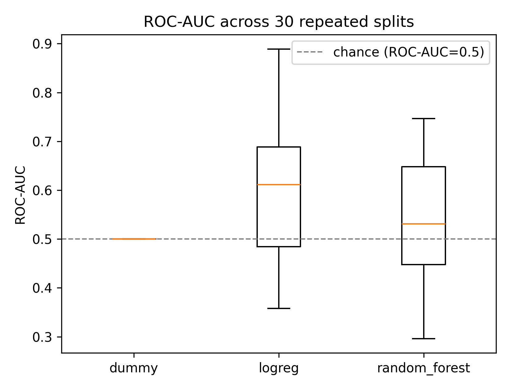
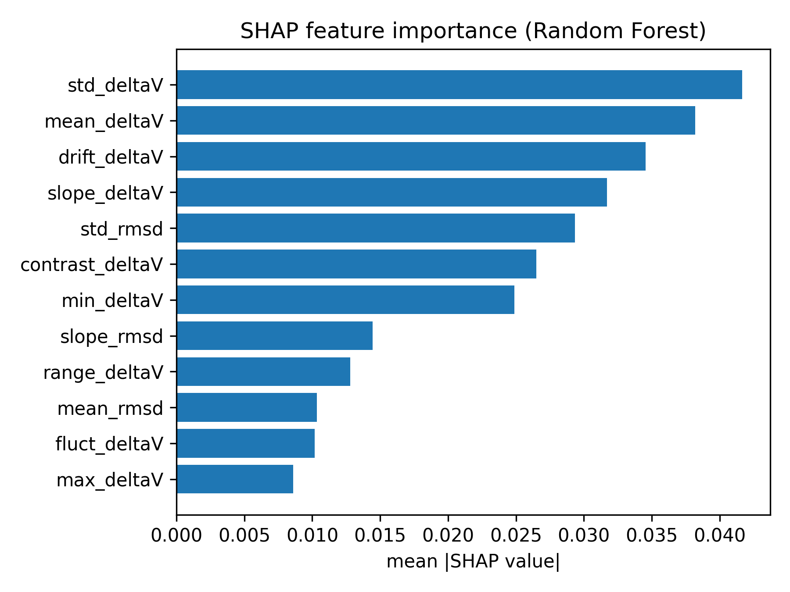

# Protein Simulation Stability Analysis

[](https://github.com/annemcq/protein-simulation-stability-analysis/actions/workflows/tests.yml)

Machine-learning analysis of whether early energy and structural signals from molecular simulations can help predict later deviation from expected thermodynamic behaviour.

The main question was:

> Can information from the beginning of a simulation help identify systems that are likely to behave abnormally later?

## Dataset

The analysis uses molecular simulation data from approximately 90 protein systems.

For each system, energy trajectories were available for three components:

- protein complex
- complex without peptide
- peptide

These were combined into an interaction-energy trajectory:

\[
\Delta V(t) = E_{\mathrm{complex}} -
(E_{\mathrm{nopep}} + E_{\mathrm{pep}})
\]

Structural trajectories were also available and used to calculate RMSD-based features.

Only the first 20% of each trajectory was used for feature extraction, so that the models only had access to information from the early part of the simulation.

After merging the available energy, structural and target data and filtering the most extreme target values, the final dataset contains 88 systems.

## Features

Energy features summarize the early ΔV trajectory:

- mean and standard deviation
- minimum, maximum and range
- slope
- drift
- contrast between different parts of the early trajectory
- fluctuation ratio

Three structural features were calculated from RMSD relative to the first trajectory frame:

- mean RMSD
- RMSD standard deviation
- RMSD slope

The final models use 12 features in total.

## Target

The prediction target is derived from `Perp_dist`, which measures deviation from a fitted ΔG relationship.

Systems below the median `Perp_dist` are assigned to the low-deviation class and systems above the median to the high-deviation class.

After preprocessing, the final dataset contains 44 systems in each class.

## Models

I compared three models:

- Dummy classifier
- Logistic Regression
- Random Forest

Logistic Regression uses standardized features. The Dummy classifier provides a baseline for determining whether the trajectory features contain useful predictive information.

ROC-AUC is used as the main evaluation metric.

## Initial evaluation

I initially evaluated the models using a single stratified 80/20 train/test split.

On this split, both machine-learning models were only slightly above the dummy baseline:

| Model | ROC-AUC |
|---|---:|
| Dummy | 0.50 |
| Logistic Regression | ~0.54 |
| Random Forest | ~0.55 |

Because the test set contains only 18 systems, these numbers are sensitive to the particular train/test split.

This motivated a repeated evaluation rather than relying on the initial result.

## Repeated evaluation

I repeated the stratified train/test split 30 times, evaluating all three models on the same data partition within each repeat.

The resulting ROC-AUC scores were:

| Model | Mean ROC-AUC | Std |
|---|---:|---:|
| Dummy | 0.500 | 0.000 |
| Logistic Regression | **0.597** | 0.137 |
| Random Forest | 0.542 | 0.125 |



The repeated evaluation changes the interpretation of the original single split. Logistic Regression performs better on average, while the Random Forest result is much less consistent.

I used paired Wilcoxon signed-rank tests across the 30 splits and applied Holm-Bonferroni correction for the three model comparisons.

| Comparison | Holm-corrected p | Significant |
|---|---:|---|
| Logistic Regression vs Dummy | 0.0049 | Yes |
| Logistic Regression vs Random Forest | 0.0274 | Yes |
| Random Forest vs Dummy | 0.1041 | No |

Logistic Regression therefore shows a modest but statistically detectable advantage over the baseline in this evaluation. Random Forest does not show a significant improvement over the dummy classifier.

The relatively large variation across splits also shows that performance estimates are uncertain with a dataset of this size.

## Feature interpretation

The original analysis used the Random Forest's impurity-based feature importance. Energy-derived variables such as drift, mean and slope of ΔV appeared among the most important features.

I later repeated the interpretation using SHAP values calculated on a held-out test split.



The highest mean absolute SHAP values were associated with:

| Feature | Mean \|SHAP value\| |
|---|---:|
| `std_deltaV` | 0.0416 |
| `mean_deltaV` | 0.0382 |
| `drift_deltaV` | 0.0346 |
| `slope_deltaV` | 0.0317 |
| `std_rmsd` | 0.0293 |

The energy-derived features remain prominent, while the simple RMSD summaries contribute less overall.

However, these importances should be interpreted cautiously. The Random Forest itself was not significantly better than the dummy baseline in the repeated evaluation, so the SHAP analysis describes what this particular model relies on rather than establishing these features as biological predictors of simulation stability.

## What I learned

The main result of the project was not a high-performing classifier. Instead, the repeated evaluation showed how unstable conclusions can be when working with a small scientific dataset.

The initial split suggested that Random Forest performed slightly better than Logistic Regression. Across repeated splits, that conclusion did not hold: Logistic Regression performed better on average and was the only model that consistently separated itself from the baseline.

Adding simple RMSD-based structural features also did not lead to a strong predictive model.

Overall, the results suggest that early trajectory summaries contain some information about later behaviour, but that the signal is limited and highly variable across train/test splits.

More detailed structural representations, time-dependent features or larger datasets would be needed before using this type of model for reliable early stopping of simulations.

## Repository structure

```text
protein-simulation-stability-analysis/
├── data/
│   ├── project3_energy_features.csv
│   ├── project3_structure_features.csv
│   ├── project3_final_dataset.csv
│   └── rank_by_distance_to_fit_deltaG_fep_BOOTSTRAP.csv
│
├── results/
│   ├── model_comparison.png
│   ├── repeated_eval_all_results.csv
│   ├── repeated_eval_boxplot.png
│   ├── paired_significance_roc_auc.csv
│   ├── shap_feature_importance.csv
│   └── shap_feature_importance.png
│
├── src/
│   ├── build_dataset.py
│   ├── extract_energy_features.py
│   ├── train_models.py
│   ├── repeated_cv_evaluation.py
│   └── shap_analysis.py
│
├── tests/
│   └── test_models_and_stats.py
│
├── requirements.txt
└── README.md
```

## Reproducing the analysis

Install the dependencies:

```bash
pip install -r requirements.txt
```

Rebuild the final dataset from the processed feature tables:

```bash
python src/build_dataset.py
```

Run the original single-split analysis:

```bash
python src/train_models.py
```

Run the 30-split evaluation and statistical comparisons:

```bash
python src/repeated_cv_evaluation.py
```

Run the SHAP analysis:

```bash
python src/shap_analysis.py
```

Run the tests:

```bash
python -m pytest
```

## Data availability

The processed datasets required to reproduce the model training and evaluation are included in the repository.

The original molecular simulation trajectories are not included because of their size and source-data constraints. `src/extract_energy_features.py` documents the RMSD feature-extraction step but requires access to the original trajectory files.

## Limitations

This is a small dataset, with 88 systems in the final analysis. The variability across repeated splits reflects that limitation.

The binary target is also a simplification of a continuous quantity (`Perp_dist`). A larger dataset could make direct regression on this quantity more useful.

Finally, the structural representation used here is deliberately simple. Global RMSD statistics cannot capture many local conformational changes or interaction patterns that may be relevant to simulation stability.

Possible extensions would include contact-based structural features, residue-level interaction descriptors or models that use the trajectory as a time series rather than reducing it to summary statistics.

## Tools

Python, NumPy, pandas, scikit-learn, SciPy, MDTraj, SHAP and matplotlib.

## License

This project is available under the MIT License.
