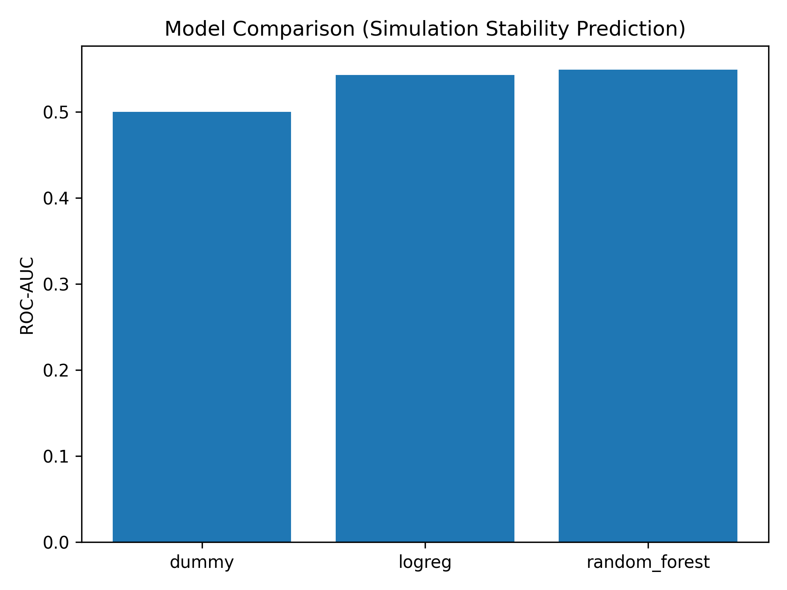

# Interpretable Machine Learning for Protein Simulation Stability Analysis

[](https://github.com/annemcq/protein-simulation-stability-analysis/actions/workflows/tests.yml)

## Project Overview

This project explores whether **early signals from molecular simulations** can be used to predict **later instability or deviation from expected thermodynamic behavior**.

The central question is:

> *Can we identify unstable simulation behavior early, using only partial trajectory information?*

---

## Motivation

Molecular simulations are computationally expensive, often requiring long trajectories to estimate quantities such as free energy (ΔG).

If instability could be detected early, this would:

* reduce computational cost
* allow early stopping of problematic simulations
* improve efficiency of simulation pipelines

---

## Dataset

The dataset consists of ~100 protein systems, each with:

* energy trajectories (~1000 frames)
* three components:

  * complex
  * no-peptide
  * peptide

From these, we compute:

ΔV(t) = E_complex − (E_nopep + E_pep)

Additionally, raw trajectory coordinates were available as `.npy` files and used to compute structural features.

---

## Methodology

### Feature Engineering

Features are extracted from the **first 20% of each trajectory**, simulating an early prediction scenario.

#### Energy-based features

* mean, standard deviation
* min, max, range
* slope (trend over time)
* drift (difference between early and late halves)
* contrast (first vs last quarter)
* fluctuation ratio

#### Structural features (RMSD)

From raw trajectory coordinates:

* mean RMSD
* standard deviation of RMSD
* RMSD slope

RMSD is computed relative to the first frame of the trajectory.

---

### Label Definition

The target is based on:

* **Perp_dist**: distance to a fitted ΔG trend

This measures how much a system deviates from expected thermodynamic behavior.

We define:

* `0` → low deviation (stable)
* `1` → high deviation (unstable)

using a median split.

---

## Models

Three models were evaluated:

* Dummy classifier (baseline)
* Logistic Regression (interpretable linear model)
* Random Forest (nonlinear model with feature importance)

---

## Results

### Model Performance

* Logistic Regression: ROC-AUC ≈ 0.54
* Random Forest: ROC-AUC ≈ 0.55
* Dummy baseline: ROC-AUC = 0.50

The models outperform the baseline slightly, indicating the presence of **weak but real predictive signal**.

---

### Model Comparison



---

### Feature Importance (Random Forest)

Most important features:

* drift of ΔV
* mean energy
* slope of ΔV
* standard deviation of energy

Structural features (RMSD) contributed less strongly.

---

## Follow-up: Is the Signal Real? (Repeated Evaluation + SHAP)

The results above come from a **single** train/test split (18 test systems out of ~90
total). With a test set that small, the gap between the dummy baseline (ROC-AUC 0.50) and
the two models could easily be an artifact of that one particular split rather than a real
effect. `src/repeated_cv_evaluation.py` repeats the split 30 times (different random seed
each time), evaluates all three models on the same split within each repeat, and runs a
paired Wilcoxon signed-rank test (Holm-Bonferroni corrected across the 3 pairwise
comparisons) — the same statistical approach used in the tcr-peptide-ranking project.

**This changes the story.** Across 30 repeats:

| Model | Mean ROC-AUC | Std |
|---|---|---|
| Dummy baseline | 0.500 | 0.000 |
| Logistic Regression | **0.597** | 0.137 |
| Random Forest | 0.542 | 0.125 |


The paired significance test (`results/paired_significance_roc_auc.csv`) shows:
- **Logistic Regression significantly beats the dummy baseline** (Holm-corrected p ≈ 0.005)
  and **significantly beats Random Forest** (p ≈ 0.027).
- **Random Forest is *not* significantly better than the dummy baseline** (p ≈ 0.10).

So the "weak but real predictive signal" from the original single-split analysis is real —
but it's coming from **Logistic Regression**, not Random Forest as the original single split
happened to suggest. Random Forest's apparent edge over baseline in that one split doesn't
hold up under repetition.

**What this means for the feature importance analysis above:** since Random Forest isn't
reliably better than chance, its `feature_importances_` ranking (and the SHAP analysis
below) should be read as "what this particular model leans on", not as confirmed evidence
of real predictive biology.

### SHAP-based interpretability 

The original feature importance relied on Random Forest’s built-in `feature_importances_`, which is based on impurity and can be biased toward features with higher variance. To make the interpretation more robust, `src/shap_analysis.py` instead calculates SHAP values on a held-out test set:


This highlights that the top features are broadly consistent with the original ranking  (`drift_deltaV`,
`mean_deltaV`, `slope_deltaV` all remain near the top), with `std_deltaV` ranking at the very top. Going back to the aforementioned caveat, these results need to be read in the context of the model's descriptive behaviour, rather than strictly a biological finding.

---

## Key Insights

* Early energy signals contain **limited predictive information** about long-term stability.
* Temporal features (drift and contrast) are more informative than static statistics.
* The predictive signal is weak, suggesting that simple summary features are insufficient.

---

## Extension: Structural Features

To improve performance, structural features based on RMSD were added.

Still, this **did not improve model performance**.

This suggests that:

* simple structural summaries (such as RMSD) are too coarse
* relevant structural information is not captured by global distance measures

More expressive structural representations (e.g. contacts or learned embeddings) may be required.

---

## What Didn’t Work

* Adding RMSD-based features did not improve predictive performance
* Classification accuracy remained close to baseline
* Simple feature engineering was insufficient to capture the full signal

---

## Interpretation

These results indicate that:

> Early trajectory summaries (both energy and RMSD) are not sufficient to reliably predict simulation stability.

This in turn, points toward the following:

* stability depends on more complex structural patterns
* richer representations or time-dependent models are needed

---

## Future Work

In the context of the results obtained, the following avenues emerge for future work:

* incorporating structural features such as contact maps or residue interactions
* using time-series models instead of summary statistics
* predicting Perp_dist directly (regression)
* combining sequence, structure, and simulation features
* applying deep learning to learn representations from raw trajectories

---

## Data Availability

Raw simulation data is not included in this repository.

The project provides:

* processed datasets
* feature extraction pipelines
* modeling scripts

---

## How to Reproduce

```bash
pip install -r requirements.txt

python src/build_dataset.py            # merges energy + structure features with labels
python src/train_models.py             # single train/test split, matches the numbers above
python src/repeated_cv_evaluation.py   # 30 repeated splits + paired significance test
python src/shap_analysis.py            # real SHAP feature importance

pytest tests/
```

Note: `src/extract_energy_features.py` (raw trajectory -> structural features) needs the
raw trajectory data, which is not included in this repository (see Data Availability
below). This documents the pipeline as originally run rather than being directly
runnable here.

## Tech Stack

* Python
* NumPy / pandas
* scikit-learn
* PyTorch (data handling)
* matplotlib

---

## Conclusion

All in all, the current project represents a comprehensive machine learning pipeline applied to molecular simulation data and illustrates both the **potential and limitations** of early prediction.

As discussed, the results emphasize that:

> Simple early features provide only weak signal, and more expressive representations are needed to model simulation stability effectively.

---
