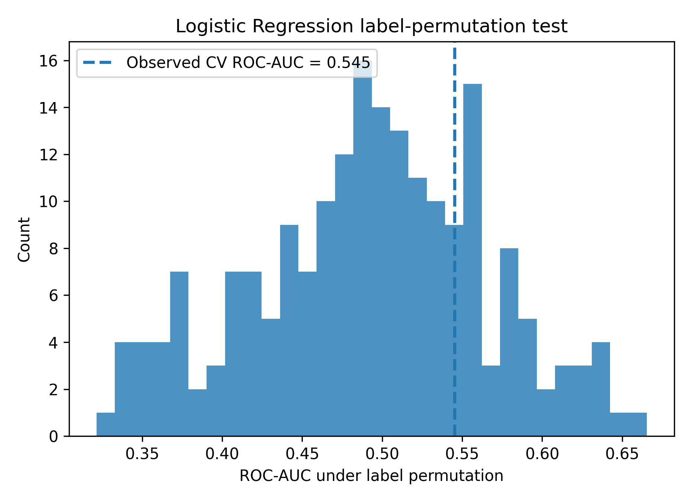

# Protein Simulation Stability Analysis

[](https://github.com/annemcq/protein-simulation-stability-analysis/actions/workflows/tests.yml)

Machine-learning analysis of whether early energy and structural signals from molecular simulations can help predict later deviation from expected thermodynamic behaviour.

The main question was:

> Can information from the beginning of a simulation help identify systems that are likely to behave abnormally later?

## Dataset

The analysis uses molecular simulation data from approximately 90 protein systems.

For each system, energy trajectories were available for three components:

- protein complex
- complex without peptide
- peptide

These were combined into an interaction-energy trajectory:

$
\Delta V(t) = E_{\mathrm{complex}} -
(E_{\mathrm{nopep}} + E_{\mathrm{pep}})
$

Structural trajectories were also available and used to calculate RMSD-based features.

Only the first 20% of each trajectory was used for feature extraction, so that the models only had access to information from the early part of the simulation.

After merging the available energy, structural and target data, 90 systems were available. I removed the lowest and highest 1% of the target distribution (`Perp_dist`) before defining the median split, which removed 2 systems and left 88 systems for analysis.

## Features

Energy features summarize the early ΔV trajectory:

- mean and standard deviation
- minimum, maximum and range
- slope
- drift
- contrast between different parts of the early trajectory
- fluctuation ratio

Three structural features were calculated from RMSD relative to the first trajectory frame:

- mean RMSD
- RMSD standard deviation
- RMSD slope

The final models use 12 features in total.

## Target

The prediction target is derived from `Perp_dist`, which measures deviation from a fitted ΔG relationship.

Systems below the median `Perp_dist` are assigned to the low-deviation class and systems above the median to the high-deviation class.

After preprocessing, the final dataset contains 44 systems in each class.

## Models

I compared three models:

- Dummy classifier
- Logistic Regression
- Random Forest

Logistic Regression uses standardized features. The Dummy classifier provides a baseline for determining whether the trajectory features contain useful predictive information.

ROC-AUC is used as the main evaluation metric.

## Evaluation strategy

I initially evaluated the models using a single stratified 80/20 train/test split. Because the test set contains only 18 systems, the resulting ROC-AUC is sensitive to which observations happen to be held out.

I therefore added two complementary resampling analyses.

### Repeated evaluation

I compared 30 repeated stratified 80/20 holdout splits with 30 repeated stratified 5-fold cross-validation runs for Logistic Regression:

| Protocol | Mean ROC-AUC | Std | Median | Range |
|---|---:|---:|---:|---:|
| 30× stratified 80/20 holdout | **0.597** | 0.137 | 0.611 | 0.358–0.889 |
| 30× repeated 5-fold CV | **0.545** | 0.038 | 0.548 | 0.463–0.606 |

The holdout estimate is higher but substantially more variable. The repeated 5-fold estimate is more stable because every observation contributes to out-of-fold evaluation across the repeated partitions.

This makes the repeated 5-fold estimate the more appropriate primary performance summary for this small dataset.


### Label-permutation test

To test whether the observed Logistic Regression performance could arise from arbitrary associations between features and labels, I performed a label-permutation test using the same repeated 5-fold protocol as the primary evaluation.

The observed mean ROC-AUC was **0.5454**. Across 200 label permutations, the null distribution had a mean of **0.4921**, standard deviation **0.0737**, and 95th percentile **0.6147**.

The permutation p-value was **0.2438**.



Thus, the observed performance is not sufficiently separated from the permutation null distribution to reject the hypothesis that the apparent predictive signal could be explained by chance.

The permutation test uses 200 permutations because each permutation repeats the full 30×5-fold evaluation protocol. This is an intentionally computationally heavier robustness check rather than a claim of high-precision p-value estimation.

### Statistical interpretation

The earlier paired Wilcoxon comparisons across repeated 80/20 splits remain useful for describing differences between resampling runs, but they should not be interpreted as independent experimental evidence because all repeats reuse the same 88 systems.

Taken together, the more conservative interpretation is that **the current dataset does not provide convincing evidence that the trajectory-derived features have reproducible predictive power for the stability label**.


## Feature interpretation

The original analysis used the Random Forest's impurity-based feature importance. Energy-derived variables such as drift, mean and slope of ΔV appeared among the most important features.

I later repeated the interpretation using SHAP values calculated on a held-out test split.


The highest mean absolute SHAP values were associated with:

| Feature | Mean \|SHAP value\| |
|---|---:|
| `std_deltaV` | 0.0416 |
| `mean_deltaV` | 0.0382 |
| `drift_deltaV` | 0.0346 |
| `slope_deltaV` | 0.0317 |
| `std_rmsd` | 0.0293 |

The energy-derived features remain prominent, while the simple RMSD summaries contribute less overall.

However, these importances should be interpreted cautiously. The Random Forest did not consistently outperform the dummy baseline across the repeated splits; because those splits reuse the same 88 systems, this comparison is descriptive rather than independent evidence of a performance difference. The SHAP analysis therefore describes what this particular model relies on rather than establishing these features as biological predictors of simulation stability.

## What I learned

The main result of the project was not a high-performing classifier. Instead, the analysis showed how easily conclusions can change when working with a small scientific dataset.

The initial holdout analysis produced a moderately positive Logistic Regression estimate, but repeated 5-fold cross-validation reduced this to **0.545 ± 0.038 ROC-AUC**. The label-permutation test also failed to reject the null hypothesis (**p = 0.244**).

Adding simple RMSD-based structural features did not produce a strong predictive model, and the Random Forest did not show a clear improvement over the dummy baseline.

Overall, the current data do not provide convincing evidence that early trajectory summaries can reliably predict later simulation stability. More detailed structural representations, time-dependent features, stronger validation on independent systems, or a larger dataset would be needed before using this type of model for reliable early stopping of simulations.

## Repository structure

```text
protein-simulation-stability-analysis/
├── data/
│   ├── project3_energy_features.csv
│   ├── project3_structure_features.csv
│   ├── project3_final_dataset.csv
│   └── rank_by_distance_to_fit_deltaG_fep_BOOTSTRAP.csv
│
├── results/
│   ├── model_comparison.png
│   ├── repeated_eval_all_results.csv
│   ├── repeated_eval_boxplot.png
│   ├── paired_significance_roc_auc.csv
│   ├── shap_feature_importance.csv
│   └── shap_feature_importance.png
│
├── src/
│   ├── build_dataset.py
│   ├── extract_energy_features.py
│   ├── train_models.py
│   ├── repeated_cv_evaluation.py
│   ├── compare_resampling_protocols.py
│   ├── permutation_test.py
│   └── shap_analysis.py
│
├── tests/
│   └── test_models_and_stats.py
│
├── requirements.txt
└── README.md
```

## Reproducing the analysis

Install the dependencies:

```bash
pip install -r requirements.txt
```

Rebuild the final dataset from the processed feature tables:

```bash
python src/build_dataset.py
```

Run the original single-split analysis:

```bash
python src/train_models.py
```

Run the 30-split evaluation and statistical comparisons:

```bash
python src/repeated_cv_evaluation.py
```

Compare the repeated 80/20 holdout and repeated 5-fold protocols:

```bash
python src/compare_resampling_protocols.py
```

Run the label-permutation test:

```bash
python src/permutation_test.py
```

This permutation test repeats 30 five-fold CV runs for each of 200 label permutations and can take substantially longer than the other analyses.

Run the SHAP analysis:

```bash
python src/shap_analysis.py
```

Run the tests:

```bash
python -m pytest
```

## Data availability

The processed datasets required to reproduce the model training and evaluation are included in the repository.

The original molecular simulation trajectories are not included because of their size and source-data constraints. `src/extract_energy_features.py` documents the RMSD feature-extraction step but requires access to the original trajectory files.

## Limitations

This is a small dataset, with 88 systems in the final analysis. The variability across repeated splits reflects that limitation.

The binary target is also a simplification of a continuous quantity (`Perp_dist`). A larger dataset could make direct regression on this quantity more useful.

Finally, the structural representation used here is deliberately simple. Global RMSD statistics cannot capture many local conformational changes or interaction patterns that may be relevant to simulation stability.

Possible extensions would include contact-based structural features, residue-level interaction descriptors or models that use the trajectory as a time series rather than reducing it to summary statistics.

## Tools

Python, NumPy, pandas, scikit-learn, SciPy, MDTraj, SHAP and matplotlib.

## License

This project is available under the MIT License.
